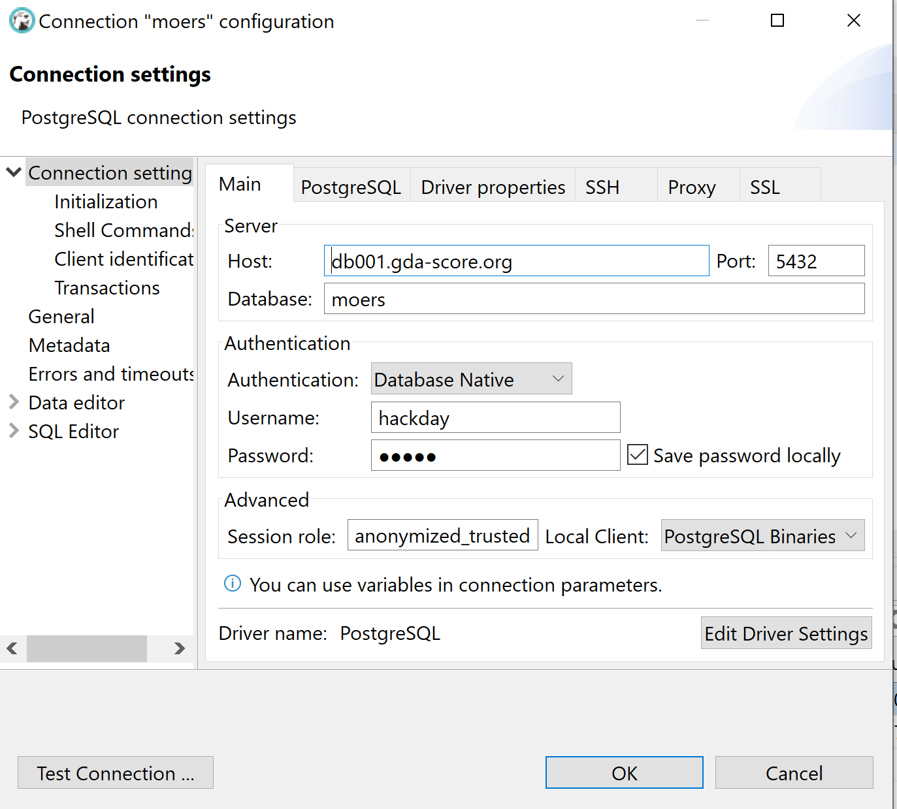

# moers-hackday

All you need to know to use Diffix anonymization for the Moers Hackday

## Data set

The data set for the [Moers Hackday](https://www.codeforniederrhein.de/hackday-2022/) consists of several years of traffic fines, both moving and stationary. The basic information for the data set is taken from [Moers Open Data](https://www.offenesdatenportal.de/organization/moers) (see [this page](https://www.offenesdatenportal.de/organization/20a7743d-057b-4e0e-a341-cf0adaf1502a?groups=transport-verkehr&tags=Bu%C3%9Fgelder)).

Moers removed all personal information from the data set. This makes the dataset private, but results in the loss of some potentially information about the data: How many different cars have been fined? How many fines do different cars have? Where do the cars come from?

Diffix allows us to learn this kind of information while still protecting privacy. To demonstrate this, we have *added* synthetic data about cars to the Moers data. We assigned cars, along with their license plate numbers according to a probability distribution. Diffix generates statistical information about the data set (including the people) without revealing individual information about the people.

## Analyze data without SQL

The [Open Diffix](https://open-diffix.org) offers a software tool, **Diffix for Desktop**, that allows an analyst to prepare anonymized tables through a simple GUI interface. It is available for Windows, Mac, or Linux.

To get started with Diffix for Desktop:

1. Download [Diffix for Desktop](https://www.open-diffix.org/download).
2. Download `finalMoers.csv.zip` from this GitHub repo and unzip.
4. After starting Diffix for Desktop, load `finalMoers.csv` into the application.
5. Configure the **AID** to be the column `PID`

Now you are ready to explore the data set.

## Analyze data with SQL

The [Open Diffix](https://open-diffix.org) offers a second tool, **Diffix for PostgreSQL** that is installed as the PostgreSQL extension `pg_diffix`. This allows analysts to access data through the standard PostgreSQL interface, thus making it possible to use a variety of standard visualization tools and SQL clients, including `psql` with Diffix.

**Diffix for PostgreSQL** offers substantially more query options than **Diffix for Desktop**. If you know SQL, or would like to learn SQL, then this is the better choice.

**Diffix for PostgreSQL** allows only a limited subset of SQL, and has some other idiosyncrasies as well. To learn how to use SQL with Diffix, we recommend [this training app](https://training.open-diffix.org/). It takes about 5 minutes to complete for basic queries, and around 30 minutes for the whole course. (It also serves as a good reference for query templates.)

We offer several options for Hackday:

### Data visualization using Metabase

[Metabase](https://www.metabase.com/) is a "Business Intelligence" tool that connects to a backend database system and let's you easily visualize data and build dashboards.  Click [here](http://metabase.open-diffix.org/public/dashboard/639cfe51-f9d5-4683-b76b-a9328f46a418) for an example of a simple dashboard built from the Moers traffic data.

Metabase supports both SQL-based and GUI-based queries. The latter doesn't work well with `pg_diffix`, but the former does. [Click here](metabase.md) for details on how to login to our Metabase installation and query the Moers traffic data.

### DBeaver SQL client

If you prefer to use a more standard SQL client, [DBeaver](https://dbeaver.io/) is a lightweight client that works for `pg_diffix`. After downloading, configure the Moers traffic database with the following parameters:

And password `moers`.