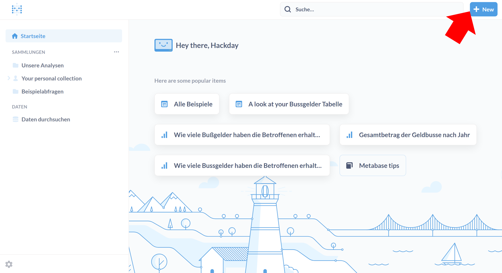
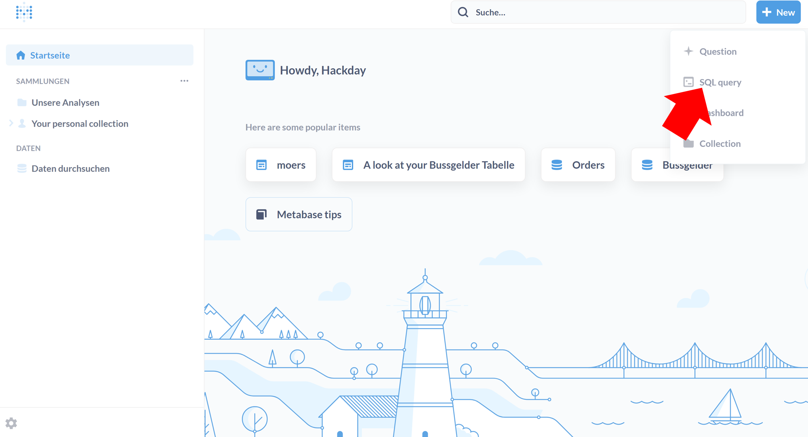
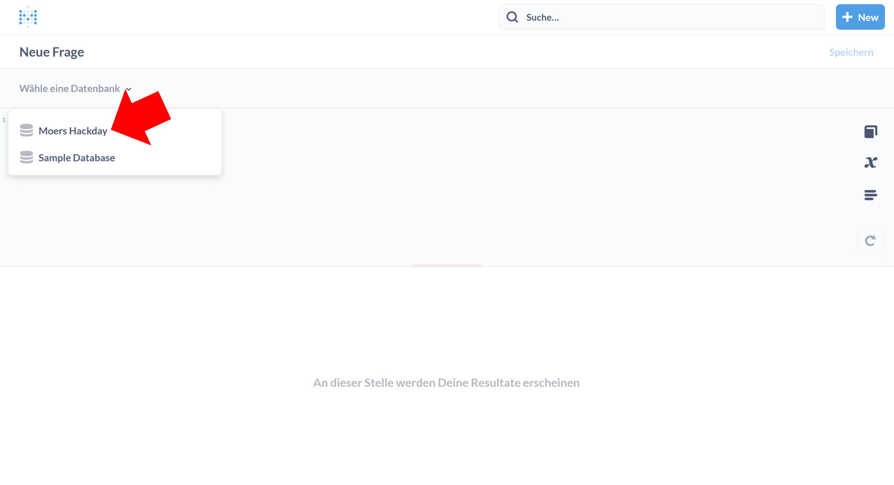
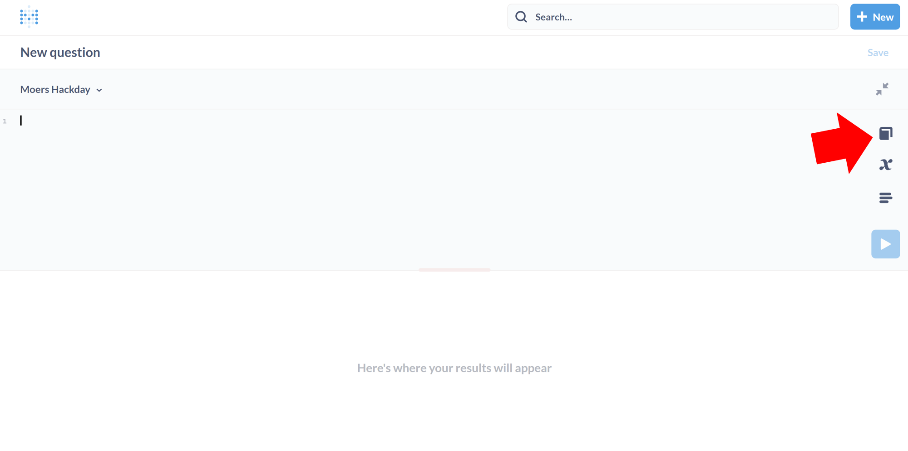
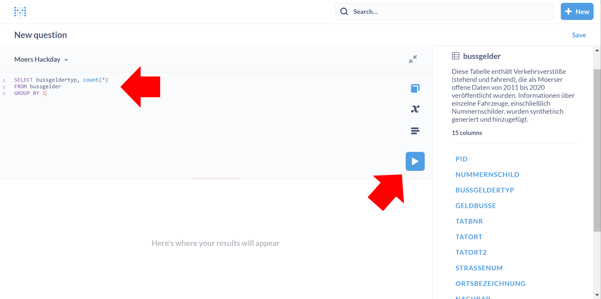
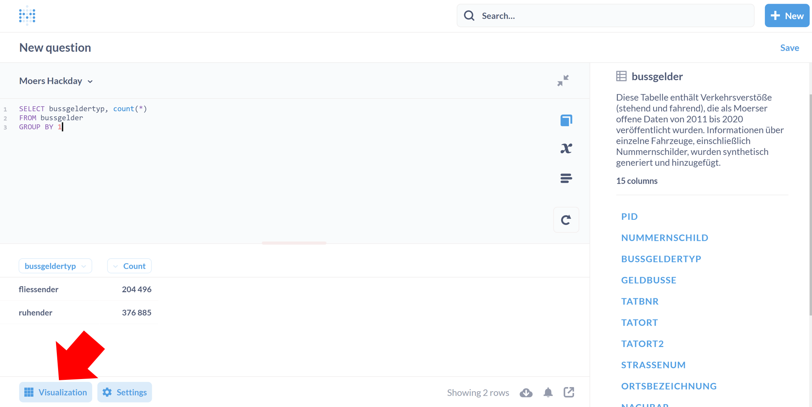

# Accessing Moers traffic data through Metabase

1. Go to [metabase.open-diffix.org](https://metabase.open-diffix.org/)
2. Login with username `hackday` and password `moers`
3. The dataset with the traffic data is called **Moers Hackday**
4. The following shows how to find the SQL query editor for Moers Hackday

## Visual guide to finding the SQL editor

After login, you should see a page more-or-less like this:

Click on 'New' in the upper right corner (see red arrow) to get this pulldown menu:

And then select "SQL Query".

Select the "Moers Hackday" dataset:

This gives you the SQL editor. It is handy to see the column names as you write queries. To do this, click on the icon shown.

Write your query and execute.

