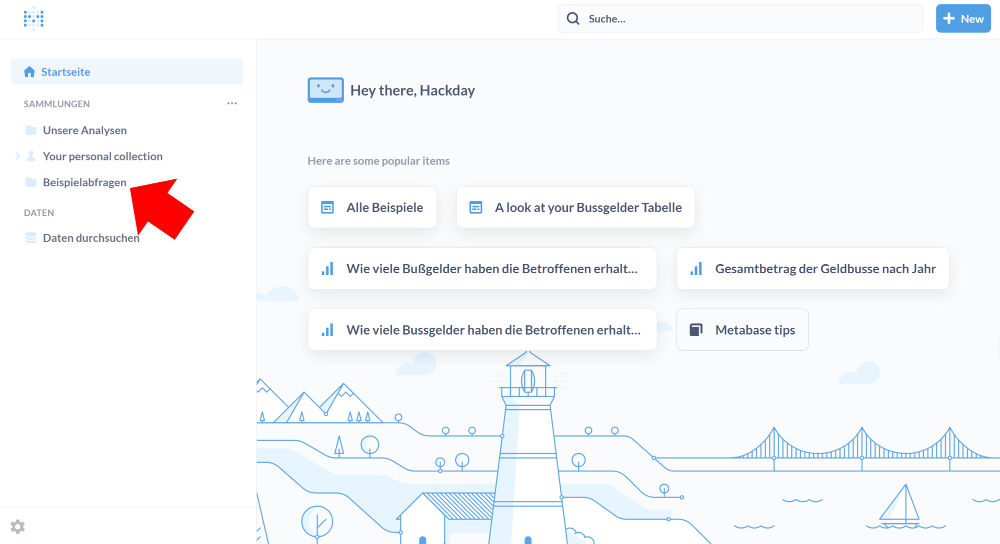
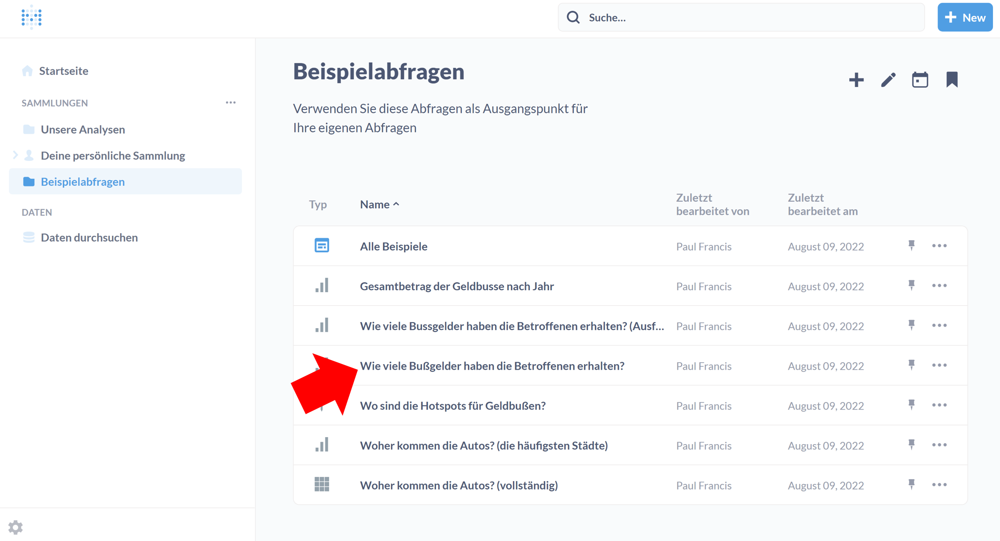
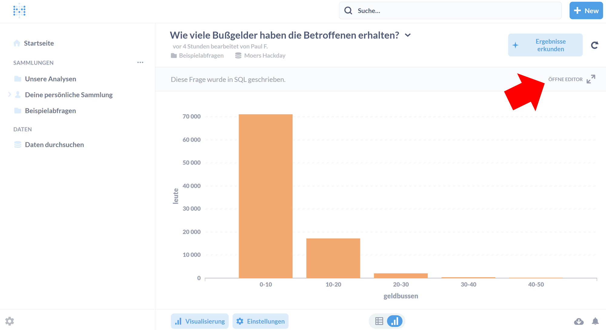
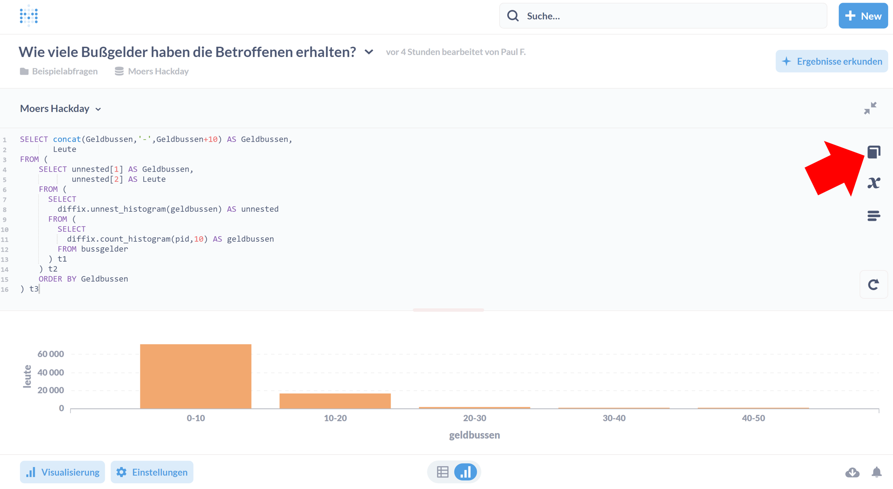
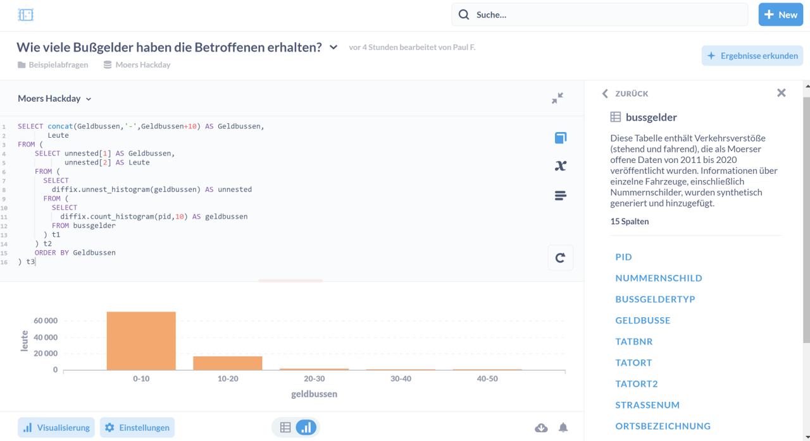

# Accessing Moers traffic data through Metabase

1. Go to [metabase.open-diffix.org](https://metabase.open-diffix.org/)
2. Login with username `participant@moershackday.de` and password `moershackday2022`
3. The dataset with the traffic data is called **Moers Hackday**
4. The following shows how to find the SQL query editor for Moers Hackday

## Visual guide to finding the SQL editor

First

Second

Third

Fourth

Fifth

Last

After login, you should see a page more-or-less like this:

(Note that you can change the interface language by clicking on the gearbox on the lower left, clicking "Admin settings", and then "Localization".)

Click on 'New' in the upper right corner (see red arrow) to get this pulldown menu:

After clicking "SQL Query" you'll see this:

Select the "Moers Hackday" dataset, and this will give you the SQL editor.  It is handy to see the column names as you write queries. To do this, click on the icon shown here:

Write your query and execute:

The "visualize" button at the bottom lets you visualize your result.

