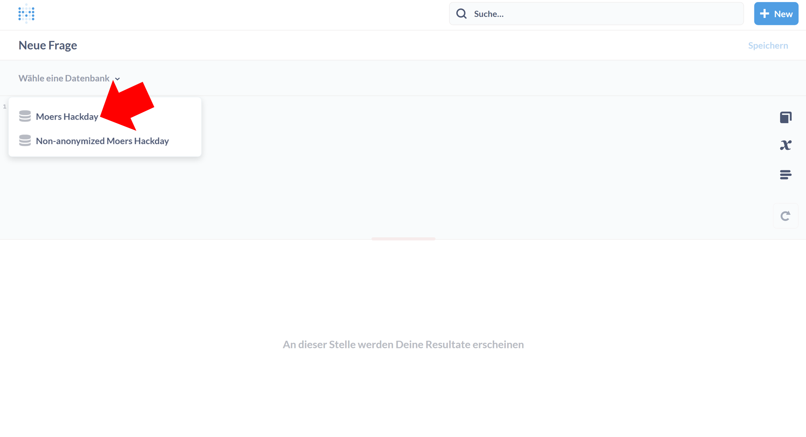

# Accessing Moers traffic data through Metabase

1. Go to [metabase.open-diffix.org](https://metabase.open-diffix.org/)
2. Login with username `hackday` and password `moers`
3. The dataset with the traffic data is called **Moers Hackday**
4. The following shows how to find the SQL query editor for Moers Hackday

## Visual guide to finding the SQL editor

After login, you should see a page more-or-less like this:

